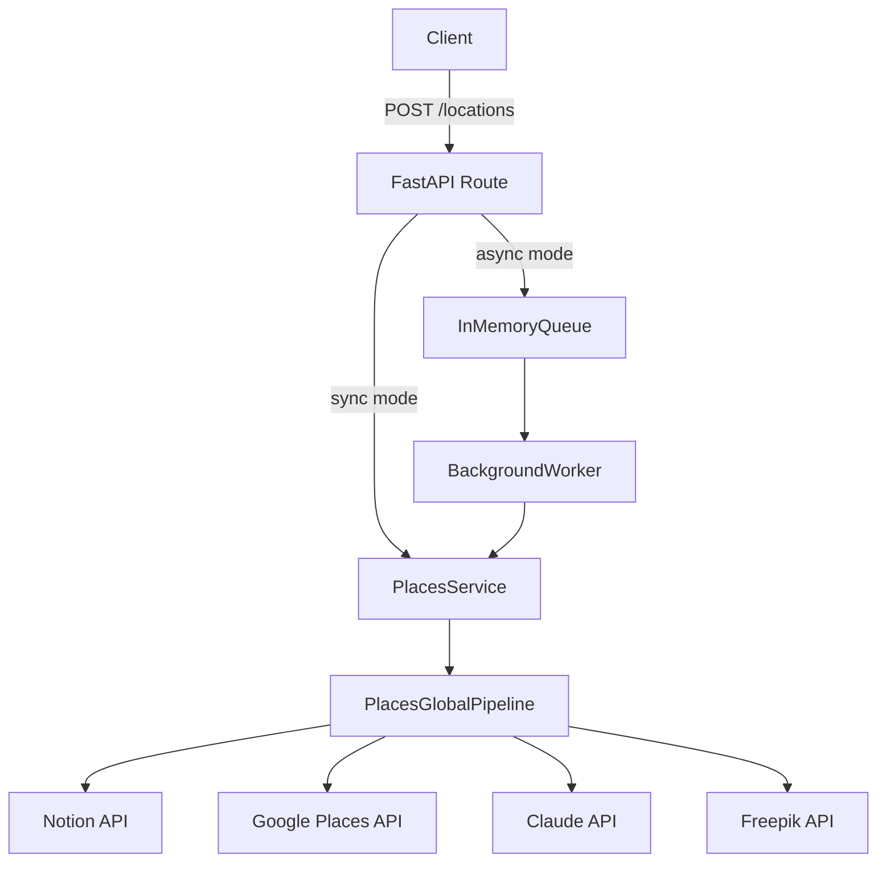

# Overview

## Purpose

Notion Place Inserter turns unstructured place text (for example, `"stone arch bridge in minneapolis"`) into a structured Notion page in the `Places to Visit` database.

The architecture is designed around:

- Deterministic API boundaries (`FastAPI` routes and auth dependency).
- A staged orchestration framework (`GlobalPipeline -> Stage -> Pipeline -> PipelineStep`).
- Integration-driven enrichment (Google Places, Claude, Freepik, Notion).
- Operational flexibility through environment-driven sync/async modes.

## Bounded Context

The core bounded context is **place ingestion**:

1. Accept query text via `POST /locations`.
2. Enrich with external data and AI inference.
3. Resolve Notion property payloads.
4. Create a Notion page (or return dry-run output).

Test utilities (`/test/*`) are intentionally separate and provide isolated checks for external dependencies and schema-derived random payloads.

## Major Architectural Layers

### API Layer (`app/main.py`, `app/routes/`)

- Boots service graph and optional background worker in lifespan.
- Exposes authenticated route handlers.
- Chooses sync or async execution path for `POST /locations`.

### Orchestration Layer (`app/pipeline_lib/`, `app/app_global_pipelines/`)

- Encodes request processing as staged pipelines.
- Supports stage-level parallel fan-out with join.
- Isolates per-pipeline failures in parallel stages.

### Domain/Service Layer (`app/services/`)

- Wraps Notion, Claude, Google Places, and Freepik integrations.
- Provides cached schema access and page creation.
- Exposes composition point via `PlacesService`.

### Async Processing Layer (`app/queue/`)

- In-memory queue and worker loop for async `/locations`.
- Publishes success/failure events from worker execution.

## Data Flow at a Glance

## Current Constraints

- Async jobs are not durable (in-memory queue; restart loses queued work).
- Schema freshness is TTL-based, not event-driven from Notion.
- External provider availability and response quality can affect resolved properties.

## Reading Path

- Runtime behavior: [Runtime and Request Flow](./runtime-and-request-flow.md)
- Orchestration internals: [Pipeline Architecture](./pipeline-architecture.md)
- Integrations and service boundaries: [Services and Integrations](./services-and-integrations.md)
