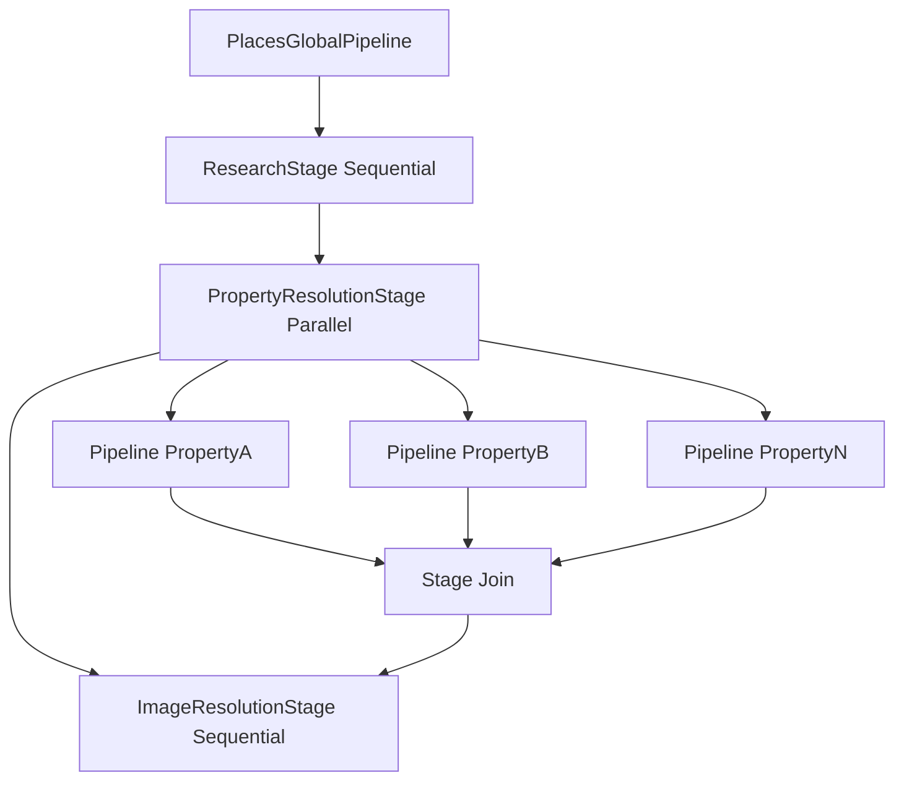

# Pipeline Architecture

## Purpose

Explain the orchestration framework used to transform input query text into a final Notion-ready payload.

## Core Abstractions

Defined in `app/pipeline_lib/core.py`:

- `GlobalPipeline`: top-level orchestrator with ordered stages.
- `Stage`: dependency boundary with `run_mode` (`sequential` by default, optional `parallel`).
- `Pipeline`: unit of work inside a stage.
- `PipelineStep`: ordered operation inside a pipeline.

Execution contracts:

- Stages run in declared order.
- Pipelines within a sequential stage run in order.
- Steps inside a pipeline always run in order.
- Parallel stages fan out pipeline execution and join before next stage.

## Concrete Global Pipeline

`PlacesGlobalPipeline` (`app/app_global_pipelines/places_to_visit.py`) defines:

1. `ResearchStage` (sequential):
   - `LoadLatestSchemaPipeline`
   - `QueryToGoogleCachePipeline`
2. `PropertyResolutionStage` (parallel):
   - One pipeline per schema property (custom pipeline or default pipeline).
3. `ImageResolutionStage` (sequential):
   - `ResolveCoverImagePipeline`
   - `ResolveIconEmojiPipeline`

## Orchestration Flow

`app/pipeline_lib/orchestration.py` runs:

- `run_global_pipeline`: loops through stages and calls `stage.run(context)`.
- `run_stage`: branches by `stage.run_mode` to sequential or parallel execution.
- `_run_pipeline`: sets active pipeline ID in context and executes within logging scope.

Parallel fan-out uses `ThreadPoolExecutor` and `as_completed`:

- Each pipeline executes in its own worker thread.
- Exceptions from individual pipelines are isolated and logged as `pipeline_failed_isolated`.
- Stage completion includes aggregate `failed_pipeline_count`.

## Pipeline Execution Diagram

## Property Pipeline Selection

In `PropertyResolutionStage`:

1. Read `DatabaseSchema` from `ContextKeys.SCHEMA`.
2. Iterate properties:
   - If property name exists in `CUSTOM_PIPELINE_REGISTRY`, use custom class.
   - Else if type is in `SKIP_TYPES`, skip.
   - Else use `DefaultPipeline` (`InferValueWithAI -> FormatForNotionType`).

This provides fallback behavior for new schema fields without requiring immediate custom code.

## Failure Semantics

### Sequential Stage

- Any pipeline/step exception propagates.
- Stage fails, then global pipeline fails.
- Request path receives failure (sync mode) or worker records failure (async mode).

### Parallel Stage

- Per-pipeline exceptions are captured when resolving futures.
- Failed pipeline is logged with `pipeline_failed_isolated`.
- Other pipelines continue and stage completes with partial results.
- Execution proceeds to later stages.

### Step-Level

- `log_step(...)` wraps each step with start/success/failure events and duration metadata.
- Step exceptions propagate to pipeline runner semantics above.

## Logging and Identity Propagation

`app/pipeline_lib/logging.py` adds scoped context metadata using `contextvars`:

- `run_id`, `global_pipeline`, `stage`, `pipeline`, `step`
- names/descriptions/counts
- timing fields (`duration_ms`)
- event phase (`start`, `success`, `failure`, `join_wait`, `join_complete`)

This gives request-to-step traceability without manual logger binding in every call site.

## Extensibility Notes

- Add a new global workflow by subclassing `GlobalPipeline` and registering it.
- Add stage-specific reusable logic in `pipeline_lib/stage_pipelines/`.
- Add domain-specific property behavior through custom pipelines in `app/custom_pipelines/`.
- Parallelism is stage-level and explicit, reducing hidden concurrency complexity.
