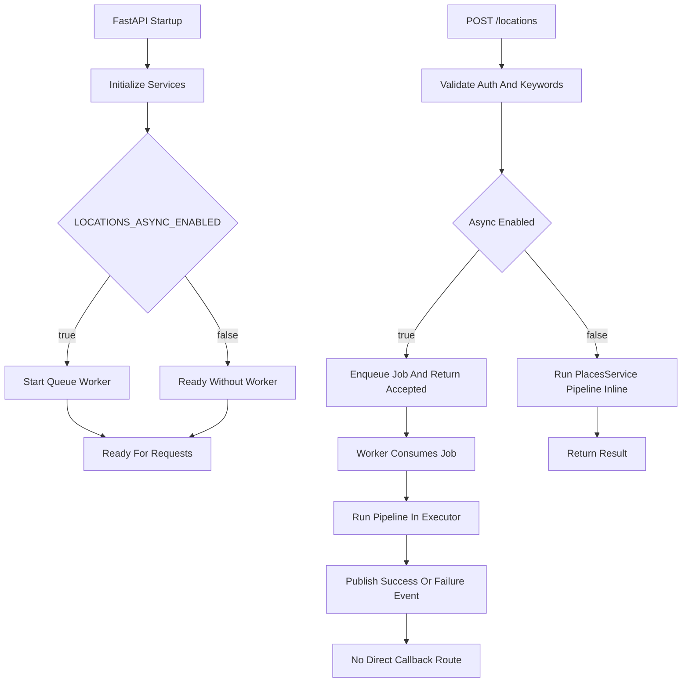

# Runtime and Request Flow

## Purpose

Describe runtime lifecycle and request execution behavior from process startup to response completion.

## Key Components

- `app/main.py`: application bootstrap, service wiring, logger setup, and lifespan-managed worker.
- `app/dependencies.py`: shared authorization dependency.
- `app/routes/locations.py`: primary ingestion endpoint.
- `app/routes/test.py`: integration test endpoints.
- `app/queue/worker.py`: async queue worker loop.

## Startup and Lifespan

On startup (`lifespan` in `main.py`), the app:

1. Configures Loguru sinks and formatting.
2. Validates required env vars (`NOTION_API_KEY`, `ANTHROPIC_TOKEN`, `GOOGLE_PLACES_API_KEY`).
3. Instantiates services and stores them in `app.state`.
4. Initializes Notion schema cache via `NotionService.initialize()`.
5. Reads `DRY_RUN` and `LOCATIONS_ASYNC_ENABLED` flags.
6. If async is enabled, creates queue + event bus and starts the worker task.

On shutdown, the app cancels and awaits the worker task when async mode is enabled.

## Auth Flow

All protected routes use `require_auth` (`app/dependencies.py`):

- Reads lowercase `secret` env variable.
- Compares incoming `Authorization` header with `hmac.compare_digest`.
- Returns `401` for missing/invalid header and `500` if server secret is unset.

`GET /` in `main.py` performs equivalent secret validation as a direct health/auth check route.

## Primary Endpoint: `POST /locations`

`create_location` in `app/routes/locations.py` executes this sequence:

1. Validate `keywords` is non-empty and <= 300 chars.
2. Check `request.app.state.locations_async_enabled`.
3. If sync mode:
   - Call `places_service.create_place_from_query(keywords)`.
   - Return final Notion page object (or dry-run preview).
4. If async mode:
   - Enqueue with `enqueue_location_job`.
   - Return `{"status": "accepted", "job_id": "..."}`
   - Worker runs the pipeline out-of-band.

## Async Worker Behavior

`run_worker_loop` in `app/queue/worker.py`:

- Polls queue with timeout loop (`asyncio.wait_for(..., timeout=1.0)`).
- Executes sync pipeline in executor thread via `run_in_executor`.
- Publishes success or failure events to `EventBus`.
- Keeps running until task cancellation during shutdown.

## Test Endpoints

`app/routes/test.py` exposes:

- `GET /test/claude`: Claude poem generation sanity check.
- `GET /test/googlePlacesSearch`: direct Google Places search check.
- `POST /test/randomLocation`: schema-derived random place generation then page creation.

## Execution Flow Diagram

## Failure Semantics

- Validation/auth failures return HTTP errors immediately (`400`, `401`, `500`).
- Async enqueue failures return `503`.
- Worker pipeline errors do not crash request thread; they are logged and published as failure events.
- Sync mode propagates pipeline failures to request context (error response behavior depends on exception handling upstream).

## Extensibility Notes

- Durable queueing can replace in-memory queue without changing route contract.
- Job status query endpoint could be added using `job_id` returned in async mode.
- Auth strategy can evolve independently (for example, token-based auth) by replacing dependency wiring.
