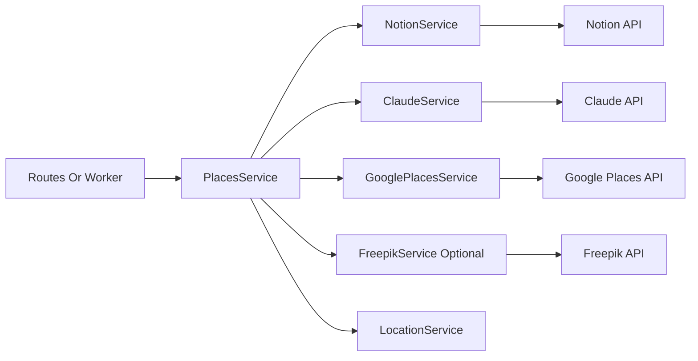

# Services and Integrations

## Purpose

Document service boundaries, ownership, and how external providers are used during place ingestion.

## Service Composition

The service graph is assembled in `app/main.py` and stored in `app.state`:

- `NotionService`
- `ClaudeService`
- `GooglePlacesService`
- `FreepikService` (optional; only when `FREEPIK_API_KEY` exists)
- `LocationService`
- `PlacesService` (composition service used by routes and worker)

`PlacesService` is the orchestration entry point for business behavior and delegates to the global pipeline runtime.

## Notion Integration

`app/services/notion_service.py` responsibilities:

- Owns Notion SDK client (`notion_client.Client`).
- Provides schema access (`get_schema`, `get_database_schema`, `get_data_source_id`).
- Creates pages (`create_page`).
- Uploads cover image bytes through Notion file upload API (`upload_cover_from_bytes`).

## Schema Caching

`SchemaCache` (`app/services/schema_cache.py`) provides lazy TTL refresh:

- Cache key: database name (`Places to Visit`, `Locations`).
- On `get(db_name)`, returns cached entry when not stale.
- If stale/missing, fetches from Notion APIs and parses to `DatabaseSchema`.
- Uses a thread lock around cache map reads/writes.

This keeps schema reasonably fresh without a polling daemon.

## Claude Integration

Claude is used by multiple pipelines for:

- Query rewriting before Google Places lookup.
- Value inference for default/fallback property pipelines.
- Specialized choice/selection logic in custom pipelines.
- Emoji/icon search term generation (paired with Freepik behavior).

Claude calls are embedded in pipeline steps and can execute concurrently in parallel stages.

## Google Places Integration

Google Places enriches input query context:

- Initial text search creates base `GOOGLE_PLACE` context.
- Optional additional details fetch can enrich summaries/components.
- Photo references support cover image resolution pipeline.

Google data is a central dependency for most custom property pipelines.

## Freepik Integration

Freepik is optional and used for icon resolution:

- If available, Claude proposes an icon search term and Freepik first result is used.
- In dry-run mode without Freepik result, pipeline can fallback to Claude-selected emoji.

## Location Relation Integration

`LocationService` is injected into context as `_location_service` and used by `LocationRelationPipeline` to:

- Resolve existing location relation targets.
- Create missing location entities when needed.
- Return Notion relation payload for the `Location` property.

## Integration Dependency Diagram

## Failure Semantics

- External API failures propagate through step/pipeline semantics.
- In parallel stages, individual pipeline failures are isolated.
- Notion cover upload failure returns `None` for cover payload (page creation still proceeds).
- Optional integrations (Freepik) degrade gracefully when absent.

## Extensibility Notes

- New integration providers should be wrapped as `app/services/*_service.py`.
- Pipeline steps should depend on injected service interfaces via context keys.
- Keep route handlers thin and integration logic inside services and pipeline steps.
