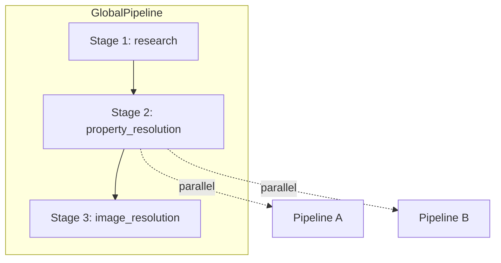

# Pipeline Framework Reference

The `pipeline_lib` package provides a reusable internal framework for staged, parallel execution of property and page-level work. It is designed with publishable quality: clear abstractions, documented contracts, and extension points.

## Architecture



### Abstractions

| Component | Responsibility |
|-----------|----------------|
| **GlobalPipeline** | Top-level orchestrator scoped to one database schema. Runs stages in declared order. |
| **Stage** | Dependency boundary. Sequential by default; `run_mode="parallel"` fans out pipelines and joins. |
| **Pipeline** | Work unit inside a stage. Contains ordered steps that run sequentially. |
| **PipelineStep** | Single operation. Receives `(context, current_value)`, returns transformed value. |

### Execution Semantics

- Stages run in declared order.
- Stages are **sequential by default**.
- A stage with `run_mode="parallel"` runs its pipelines concurrently via `ThreadPoolExecutor`, then joins.
- Inside a pipeline, steps run sequentially.
- Per-pipeline failures in parallel stages are isolated (logged, not propagated).
- Critical stage failures (e.g. research) propagate and stop the run.

## Extension Points

### Creating a Custom Property Pipeline

1. Create a class that extends `Pipeline`.
2. Implement `pipeline_id` and `steps()`.
3. Register in `custom_pipelines.CUSTOM_PIPELINE_REGISTRY` mapping property name to your class.

Example:

```python
class TitlePipeline(Pipeline):
    def __init__(self, prop_name: str, prop_schema: PropertySchema):
        self._prop_name = prop_name
        self._prop_schema = prop_schema

    @property
    def pipeline_id(self) -> str:
        return f"title_{self._prop_name}"

    def steps(self) -> list[PipelineStep]:
        return [
            ExtractDisplayName(),
            FormatAsNotionTitle(self._prop_name),
        ]
```

### Creating a New Global Pipeline

1. Extend `GlobalPipeline`.
2. Implement `pipeline_id`, `schema_binding`, and `stages()`.
3. Register in `app_global_pipelines.REGISTRY`.

### Reusable Steps

- `pipeline_lib/steps/google_places.py`: `ExtractDisplayName`, `ExtractFormattedAddress`, `ExtractWebsiteUri`, `ExtractGoogleMapsUri`, `ExtractRating`
- `pipeline_lib/steps/notion_format.py`: `FormatAsNotionTitle`, `format_value_for_notion()`

### Constant Value / Source Pipeline

The `Source` property uses a fixed constant-value pipeline (`SourcePipeline`) that always resolves to `"Notion Place Inserter"`, regardless of input.

### Neighborhood Pipeline

The `Neighborhood` property uses a custom pipeline (`NeighborhoodPipeline`) that infers neighborhood from Google place data:

1. **InferNeighborhoodStep** — Builds candidate context from `GOOGLE_PLACE` (neighborhood, formattedAddress, displayName, primaryType, types, summaries). Uses `ClaudeService.choose_option_with_suggest_from_context()` with `allow_suggest_new=True` to map to one existing schema option or suggest a new neighborhood when evidence is strong.
2. **FormatNeighborhoodStep** — Formats as Notion `select`.

**Decision logic:**

- **No value when inappropriate:** For places where neighborhood does not apply (e.g. national parks, landmarks in remote areas), Claude returns no value and the property is left unset.
- **Match existing option:** When the context clearly maps to an existing schema option (e.g. "South Minneapolis"), that option is selected.
- **Create new neighborhood:** When a neighborhood definitely applies, no existing option matches, and the Google response provides enough evidence (e.g. from addressComponents), a new neighborhood value is created and the message `Value not found for {field}, creating new neighborhood {value}` is logged.

**Google enrichment:** The Research stage requests `addressComponents` in the field mask. The service normalizes `neighborhood` from `addressComponents` (preferring neighborhood/sublocality types, falling back to locality). Place Details enrichment merges neighborhood-related fields when available.

### Description / Notes Pipeline

The `description_Notes` pipeline produces rich, factual place summaries for the Notes property:

1. **BuildFactPackStep** — Extracts structured facts from `GOOGLE_PLACE` (name, address, type, editorialSummary, generativeSummary, rating).
2. **ClaudePolishDescriptionStep** — Rewrites the fact pack into a single natural paragraph via Claude. Uses only provided facts; never invents details.
3. **FormatDescriptionStep** — Formats as Notion `rich_text`.

**Fallback behavior:** If Claude is unavailable or errors, a deterministic template is used (editorialSummary or generativeSummary preferred; otherwise "name at address. Rating: X/5").

**Google enrichment:** The Research stage fetches `places.generativeSummary` in the initial Text Search. When the search result lacks narrative summary fields, an optional Place Details call enriches the context with `editorialSummary` and `generativeSummary`. Set `GOOGLE_PLACE_DETAILS_FETCH=0` to disable the details fetch and reduce API usage.

### Location Relation Pipeline

The `Location` property (Places to Visit) uses a custom pipeline (`LocationRelationPipeline`) that resolves the relation to the Locations DB:

1. **BuildLocationCandidateStep** — Builds `LocationCandidate` from `GOOGLE_PLACE` (locality, state, country from addressComponents) or falls back to `RAW_QUERY`.
2. **ResolveLocationRelationStep** — Calls `LocationService.resolve_or_create(candidate)` to match an existing location or create a new one. Parent location (e.g. state) is resolved when present.
3. **FormatLocationRelationForNotionStep** — Outputs Notion relation payload for the `Location` property.

**Context keys:** `_location_service` (injected by PlacesService), `_location_candidate`, `_location_resolution`.

**Failure semantics:** By default, resolution failures are logged and the property is skipped. Set `LOCATION_RELATION_REQUIRED=1` to propagate failures.

## Run Context

`PipelineRunContext` holds shared state for a run:

- `get(key)`, `set(key, value)` for arbitrary data
- `set_property(name, value)` for resolved Notion properties
- `get_properties()` returns the merged property dict
- `snapshot()` for debugging or AI prompts

Convention keys (see `ContextKeys`): `RAW_QUERY`, `REWRITTEN_QUERY`, `GOOGLE_PLACE`, `SCHEMA`, `PROPERTIES`, `COVER_IMAGE`.

`GOOGLE_PLACE` includes normalized fields: `displayName`, `formattedAddress`, `rating`, `primaryType`, `types`, `generativeSummary`, `editorialSummary`, `addressComponents`, `neighborhood` (when available from search or Place Details). The `neighborhood` field is derived from `addressComponents` (neighborhood/sublocality preferred, locality as fallback).

## Logging Contract

### Event Names

| Event | Level | When |
|-------|-------|------|
| `pipeline_request_started` | INFO | PlacesService begins pipeline run |
| `pipeline_request_completed` | INFO | Pipeline run finished successfully |
| `pipeline_request_failed` | ERROR | Pipeline run failed |
| `global_pipeline_started` | INFO | Global pipeline begins |
| `global_pipeline_completed` | INFO | Global pipeline finished |
| `global_pipeline_failed` | ERROR | Global pipeline failed |
| `stage_started` | INFO | Stage begins |
| `stage_completed` | INFO | Stage finished (or `join_complete` for parallel) |
| `stage_failed` | ERROR | Stage failed |
| `stage_fan_out_started` | INFO | Parallel stage begins fan-out |
| `pipeline_started` | INFO | Pipeline begins |
| `pipeline_completed` | INFO | Pipeline finished |
| `pipeline_failed` | ERROR | Pipeline failed (sequential; propagates) |
| `pipeline_failed_isolated` | WARNING | Pipeline failed (parallel; isolated) |
| `step_start` | INFO | Step begins |
| `step_complete` | INFO | Step finished |
| `step_failed` | ERROR | Step failed |

### Structured Metadata Fields

Every orchestration log carries identity and context:

- **Identity**: `run_id`, `global_pipeline`, `stage`, `pipeline`, `step` (when relevant)
- **Event**: `event` — `start`, `success`, `failure`, `join_wait`, `join_complete`
- **Timing**: `duration_ms` (on completion/failure events)

**Descriptive metadata** (when available):

- `global_pipeline_name`, `global_pipeline_description`, `stage_count`
- `stage_name`, `stage_description`, `stage_run_mode`, `pipeline_count`
- `pipeline_name`, `pipeline_description`, `step_count`
- `step_name`, `step_description`, `step_index`, `step_count`
- `property_name`, `property_type` (for property pipelines)
- `failed_pipeline_count` (parallel stage with isolated failures)

### Logging Helpers and Scoped Context

Logging uses **contextvars** for scoped context propagation. Context is thread-safe and isolated per execution path; parallel pipelines each set their own context when they run.

**Lifecycle context managers** (use these to keep execution code concise):

- `log_global_pipeline(global_pipeline, context)` — wraps global pipeline run
- `log_stage(stage, context)` — wraps stage run; yields `result` (set `result.failed_count` for parallel stages)
- `log_pipeline(pipeline, context, run_id, stage_id)` — wraps pipeline run
- `log_pipeline_request(run_id, keywords_preview, dry_run)` — wraps request-level run; yields `result` (set `result.property_count` before exit)
- `log_step(...)` — wraps step execution; pass orchestration IDs from `context`

**Low-level helpers:**

- `log_context(**fields)` — push fields into scoped context for the block; restores on exit
- `bind_orchestration(...)` — return a loguru-bound logger with identity fields

The app configures Loguru in `main.py` to render contextual metadata (run_id, stage, pipeline, step, duration_ms, etc.) when present. Message text stays lightweight; metadata comes from bound context.

Core abstractions (`GlobalPipeline`, `Stage`, `Pipeline`, `PipelineStep`) expose default `name` and `description` properties for logging; override to customize.

## Default Fallback

For properties without a custom pipeline:

1. Skip if `prop_schema.type` is in `SKIP_TYPES` (relation, formula, etc.).
2. Otherwise use `DefaultPipeline`: `InferValueWithAI` → `FormatForNotionType`.

## Concurrency

- Sync services (Claude, Google) run in the main thread or via `ThreadPoolExecutor` for parallel stages.
- For async migration: use `asyncio.to_thread()` or async HTTP clients.

## Failure Semantics

- **Step failure**: Logged, exception propagates to pipeline.
- **Pipeline failure (sequential stage)**: Propagates to stage, run stops.
- **Pipeline failure (parallel stage)**: Logged, other pipelines continue; partial results used.
