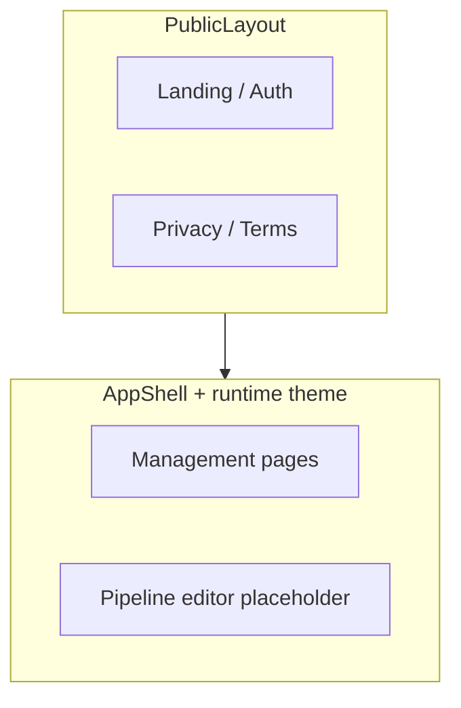

# Architecture push: Beta UI general polish

**Status:** Open (execution is iterative QA)  
**Audience:** Frontend engineers and anyone running a beta visual pass; product for scope boundaries  
**Primary code:** [`notion_pipeliner_ui`](../../../../../notion_pipeliner_ui/) — routes under [`src/routes/`](../../../../../notion_pipeliner_ui/src/routes/), shell in [`AppShell.tsx`](../../../../../notion_pipeliner_ui/src/layouts/AppShell.tsx), global styles in [`App.css`](../../../../../notion_pipeliner_ui/src/App.css) / [`index.css`](../../../../../notion_pipeliner_ui/src/index.css)

---

## Product / architecture brief

Deliver a **cross-page consistency pass** so every shipped surface in the management app and public shell looks intentional: spacing, typography hierarchy, empty and loading states, tables/forms, and top-bar usage match the **Calm Graphite** direction and the UI style guide. This is **visual and interaction polish**, not new product features.

Success for beta: a reviewer can walk the route tree (see below) without hitting obvious layout bugs, misaligned components, or “placeholder” styling that undermines trust.

---

## Scope and boundaries

### In scope

- **Authenticated shell** — Sidebar nav, top bar (`TopBarContext` titles/actions), main content width and padding, scroll behavior, sign-out affordance.
- **Public shell** — Landing, auth, legal pages using `PublicLayout` (header, content region).
- **Management list and settings pages** — Dashboard, Pipelines index, Triggers, Connections, Data Targets, Account, admin Theme (when visible).
- **Runtime theming** — Surfaces that consume `GET /theme/runtime` via [`useRuntimeUiTheme`](../../../../../notion_pipeliner_ui/src/hooks/useRuntimeUiTheme.ts) should remain legible and on-token when admin theme overrides apply (contrast, focus rings, semantic colors).
- **Cross-cutting patterns** — Buttons, form fields, cards, tables, empty states, error copy placement (align with [`styleguide/components.md`](../../../../../notion_pipeliner_ui/styleguide/components.md)).

### Out of scope (handled in sibling tracks)

- **Pipeline graph cell + step inspector depth** (schema-driven controls, binding UX, template-specific panels) — [Pipeline cell / step detail UI polish](./pipeline-cell-step-detail-ui-polish.md).
- **Admin invitation list/issue/revoke** — [Admin invitation management UI](./admin-invitation-management-ui.md).
- **Backend error contract / OTEL** — [Error handling, observability, and telemetry](./error-handling-observability-and-telemetry.md) (this doc only cares how errors *look* in toasts and inline alerts once APIs stabilize).

### Dependencies

- **Style guide (implementation canon):** [`notion_pipeliner_ui/styleguide/README.md`](../../../../../notion_pipeliner_ui/styleguide/README.md) — layout, color, components, pipeline editor tokens, dos/don’ts.
- **Product design direction (pre-token):** [`docs/style/design-direction-options.md`](../../../style/design-direction-options.md) — Option A context; detailed tokens live in the UI style guide.
- **Routes:** Single source of truth is [`main.tsx`](../../../../../notion_pipeliner_ui/src/main.tsx) (below).

---

## Page and layout inventory

Routes are registered in React Router as follows. Use this as the **checklist** for a manual polish pass (and for splitting work by PR).

| Area | Path | Route module | Notes |
|------|------|--------------|--------|
| Public | `/` | [`LandingPage`](../../../../../notion_pipeliner_ui/src/routes/LandingPage.tsx) | Marketing tone; verify `PublicLayout` header links |
| Public | `/auth` | [`AuthPage`](../../../../../notion_pipeliner_ui/src/routes/AuthPage.tsx) | Auth-only route wrapper (`PublicOnlyRoute`) |
| Public | `/about/privacypolicy` | [`PrivacyPolicyPage`](../../../../../notion_pipeliner_ui/src/routes/PrivacyPolicyPage.tsx) | Outside `PublicOnlyRoute`; still `PublicLayout` |
| Public | `/about/termsofuse` | [`TermsOfUsePage`](../../../../../notion_pipeliner_ui/src/routes/TermsOfUsePage.tsx) | Same |
| App | `/dashboard` | [`DashboardPage`](../../../../../notion_pipeliner_ui/src/routes/DashboardPage.tsx) | `AppShell` + top bar |
| App | `/pipelines` | [`PipelinesPage`](../../../../../notion_pipeliner_ui/src/routes/PipelinesPage.tsx) | List / empty state |
| App | `/pipelines/new`, `/pipelines/:id` | [`PipelineEditorPlaceholder`](../../../../../notion_pipeliner_ui/src/routes/PipelineEditorPlaceholder.tsx) | Canvas uses `app-shell-content--locked`; heavy polish split to pipeline-cell doc |
| App | `/triggers` | [`TriggersPage`](../../../../../notion_pipeliner_ui/src/routes/TriggersPage.tsx) | |
| App | `/connections` | [`ConnectionsPage`](../../../../../notion_pipeliner_ui/src/routes/ConnectionsPage.tsx) | |
| App | `/data-targets` | [`DataTargetsPage`](../../../../../notion_pipeliner_ui/src/routes/DataTargetsPage.tsx) | Style guide copy still says “Database Targets” in places — align naming in UI copy if needed |
| App | `/account` | [`AccountPage`](../../../../../notion_pipeliner_ui/src/routes/AccountPage.tsx) | |
| App | `/admin/theme` | [`AdminThemePage`](../../../../../notion_pipeliner_ui/src/routes/AdminThemePage.tsx) | Nav item only when `getManagementAccount` reports `user_type === "ADMIN"` ([`AppShell`](../../../../../notion_pipeliner_ui/src/layouts/AppShell.tsx)) |

---

## Visual QA checklist (condensed)

Full criteria live in the style guide; this list is the **minimum bar** for beta.

1. **Typography** — Page titles vs section headings vs body; no accidental all-caps except where the guide allows.
2. **Spacing** — Consistent vertical rhythm between sections; form groups use the same gap as other pages.
3. **Interactive states** — Hover, focus-visible, active, disabled for links and buttons; no missing focus rings on keyboard nav.
4. **Empty and loading** — Empty states use the shared patterns from [`components.md`](../../../../../notion_pipeliner_ui/styleguide/components.md); loading does not jump layout (skeleton or stable min-height where applicable).
5. **Tables and lists** — Header alignment, row hover, truncation with tooltip or expand pattern where needed.
6. **Errors** — User-visible messages are scannable (title + detail); avoid raw JSON or internal keys in default views.
7. **Responsive width** — Main column does not collide with sidebar at common laptop widths; public pages do not overflow horizontally.
8. **Theme** — With admin theme overrides, text/background contrast remains acceptable; sidebar and top bar still look coherent.

---

## Phased polish passes (suggested)

Execution order is flexible; grouping by **surface type** keeps PRs reviewable.

| Phase | Focus | Typical PR size |
|-------|--------|------------------|
| **P0 — Shell** | `AppShell` sidebar, top bar, content padding; `PublicLayout` header and legal pages | Small |
| **P1 — List/settings** | Dashboard, Pipelines list, Triggers, Connections, Data Targets, Account | Medium (split by route if large) |
| **P2 — Admin theme** | `/admin/theme` preview and controls vs runtime CSS variables | Small |
| **P3 — Editor chrome** | Full-bleed editor layout, zoom/pan feel, top bar integration — **without** duplicating inspector/canvas cell work tracked in [pipeline-cell-step-detail-ui-polish](./pipeline-cell-step-detail-ui-polish.md) | Medium |

**Related backlog (work-log):** “Fix pipeline zoom” when selecting a node is called out in [`work-log.md`](../../work-log.md) under **Next thing to work on** — treat as editor UX; coordinate with P3 so viewport behavior is fixed once, not twice.

---

## Risks and gaps

| Risk | Mitigation |
|------|------------|
| **Scope creep** into schema/editor features | Keep PRs labeled “polish” vs functional; defer binding/schema work to the pipeline-cell doc. |
| **Theme flash or fallback** if runtime theme fails | `useRuntimeUiTheme` already surfaces errors to state; ensure UI degrades to static CSS variables without broken contrast (document any gap in a follow-up). |
| **Duplicate standards** between this repo’s `docs/style/` and `notion_pipeliner_ui/styleguide/` | **Implementation** follows the UI style guide; `docs/style/` remains directional — link, don’t fork token tables. |
| **Admin-only surfaces** missed in QA | Run pass with an admin account so `/admin/theme` and admin nav are included. |

---

## Observability

No new backend metrics are required for this track. Optional: short **manual test notes** in PR descriptions (routes touched, theme on/off) so beta testers know what was verified.

---

## Open questions

1. **Screenshot or Percy-style regression** — Whether to add visual regression tests post-beta; out of scope unless prioritized.
2. **Mobile / narrow viewport** — Style guide targets desktop-first management UX; confirm minimum width for beta if customers expect tablet use.

---

## References

- [Beta launch readiness hub](./README.md)
- [Pipeline cell / step detail UI polish](./pipeline-cell-step-detail-ui-polish.md) — inspector + graph cell depth
- [UI style guide README](../../../../../notion_pipeliner_ui/styleguide/README.md)
- [Design direction (Option A)](../../../style/design-direction-options.md)
