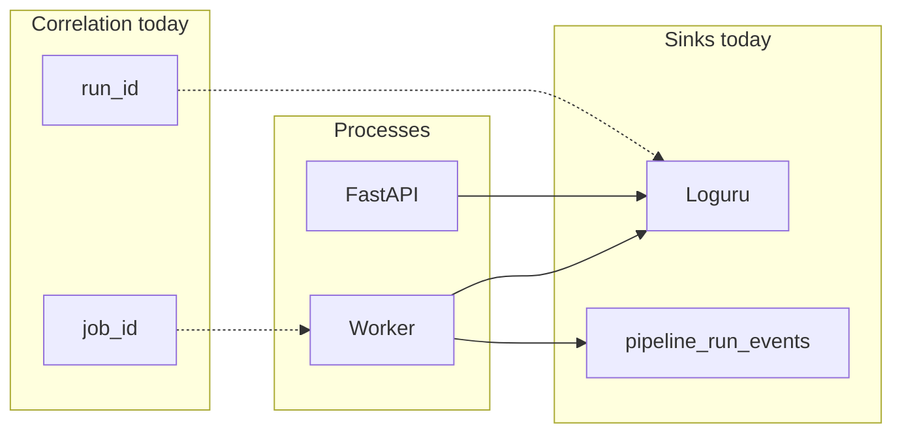

# Architecture push: Error handling, observability, and telemetry

**Audience:** Backend / platform engineers, operators, and anyone designing pipeline failure UX and dashboards.

**Status:** **Open** — detailed design below; most **implementation** beyond today’s logging and run events is **not started**. **Review:** Ready for review (no human sign-off recorded in [`work-log.md`](../../work-log.md)).

**Related:** [Enhanced user monitoring and cost tracking](./enhanced-user-monitoring-and-cost-tracking.md) (`usage_records` / spend attribution — complements but does not replace error metrics), [Worker horizontal scaling and queue coordination](./worker-horizontal-scaling-and-queue-coordination.md) (multi-consumer + visibility timeout — affects duplicate execution and what logs mean), Phase 1 [p1_pr07 — Tests, observability, API docs](../phase-1-platform-migration/p1_pr07-tests-observability-and-api-doc-updates.md). Historical snapshot: [Operations and observability (v1.0.0)](../../architecture-breakdowns/v1.0.0/operations-and-observability.md) — **partially superseded** (queue is now durable `pgmq`, not only in-memory).

---

## Product / architecture brief

We need a deliberate model for **error propagation** (step → pipeline → stage → run), **user-controlled strictness** (e.g. “if this step fails, fail the whole pipeline” vs softer behavior), and **operator telemetry** so we can measure **what** failed, **why**, whether rates are **rising or falling**, and drill from aggregates into **logs and (eventually) traces**.

We also need **user-visible** diagnostics when someone tests a pipeline: structured run/step information in the product, not only raw backend logs.

The approach must **scale** with multiple API and worker replicas: logs and metrics should identify **which instance** handled work and tie to **`run_id` / `job_id`** without ad hoc printf debugging.

For **HTTP and database latency**, we want **low friction** for developers: middleware / instrumentation and a **small number of** explicit call sites for domain metrics—not scattered one-off timers.

We should pick a **pluggable** abstraction for metrics/traces/logs export so we can swap backends (OTEL collector vs vendor) **without** editing hundreds of call sites.

---

## Current state (audit — grounded in repo)

### Logging

- **Loguru** is the standard logger. Configuration lives in [`app/main.py`](../../../../app/main.py): console (`stderr`) plus rotating file (`LOG_FILE_PATH`, `LOG_FILE_ROTATION`, `LOG_FILE_RETENTION`), level from `LOG_LEVEL`.
- **Orchestration context** is appended to each line when keys are present: `_CONTEXT_KEYS` includes `run_id`, `global_pipeline`, `stage`, `pipeline`, `step`, `event`, `duration_ms`, `error`, and many step/property-related fields. Output is **pipe-oriented text**, not JSON, but is structured enough for grep and log platforms.
- **Pipeline lifecycle** helpers in [`app/pipeline_lib/logging.py`](../../../../app/pipeline_lib/logging.py) use **contextvars** (`log_context`) so nested `log_global_pipeline` → `log_stage` → `log_pipeline` → `log_step` scopes merge fields. Events include `step_start`, `step_complete`, `step_failed`, `pipeline_failed`, `stage_failed`, `global_pipeline_failed`, etc., with durations where applicable.

### Failure semantics (today)

| Situation | Behavior |
|-----------|----------|
| **Sequential stage** | Pipelines run in order ([`run_stage`](../../../../app/pipeline_lib/orchestration.py)). First uncaught exception **fails the pipeline** and **propagates** (fails the stage / global run). |
| **Parallel stage** | Pipelines run concurrently (`ThreadPoolExecutor`). A failure in one pipeline is **isolated**: **`pipeline_failed_isolated`** (WARNING), others continue. Stage completes with optional `failed_pipeline_count` in structured log context. |

There is **no** per-definition user flag yet for “fail fast on first step” vs “best effort” beyond this **framework** behavior. Handlers that catch exceptions internally may **hide** failures from orchestration—**policy** must be reflected in handler contracts and tests.

### Correlation identifiers

- **`run_id`** is the primary key for stitching logs into a single run.
- **Worker** paths correlate **`job_id`** + **`run_id`** (e.g. `worker_pipeline_failed`, `worker_dequeued`, `worker_retry_scheduled` — see [`app/queue/worker.py`](../../../../app/queue/worker.py)).
- **Queue / subscriber** code documents correlation for subscribers ([`app/queue/events.py`](../../../../app/queue/events.py)).

### Persisted run events (product-facing bridge)

- **`pipeline_run_events`** via `insert_event` on the run repository: e.g. `pipeline_started`, `pipeline_failed`, with JSON payloads. Used on worker lifecycle and failure paths.
- INFO logs such as **`postgres_run_event`** mirror inserts for operators ([`app/repositories/postgres_run_repository.py`](../../../../app/repositories/postgres_run_repository.py)).

This is the natural backbone for **user-visible** timelines; it is **not** a full distributed trace.

### Worker-specific observability

- **`worker_pipeline_failed`** includes `exception_class`, optional Notion **`notion_data_source_id`**, `attempt`, and normalized error text.
- **Retries** and **non-retriable** SQL paths are logged (`worker_retry_scheduled`, `worker_non_retriable_terminal`).
- **Idle / dequeue** logging helps diagnose “API enqueued but worker silent” (see [`work-log.md`](../../work-log.md) entries on `worker_queue_poll_idle`, `worker_dequeued`).

### Gaps (explicit)

- **No OpenTelemetry** (or other standard trace/metrics SDK) in the codebase today.
- **No** built-in FastAPI middleware exporting request duration / error counts to a metrics backend.
- **No** centralized **metrics** facade wired to Prometheus / OTLP / Datadog.
- **Dashboards and alerting** are **out of band** (host logs, manual queries on `job_runs` / events, future metrics stack).

---

## Target design

### 1. Failure and propagation policy (product + runtime)

- Introduce **explicit policies** in job/pipeline metadata (exact schema TBD with definitions storage): e.g. behavior on step failure — **fail pipeline**, **fail stage**, **record and continue** (illustrative names).
- Keep **parallel isolation** as default; optionally allow **fail stage if any parallel pipeline failed** where product needs strictness.
- Persist **stable error codes** (and short messages) on terminal run rows and/or events so dashboards do not rely only on unstructured strings.

### 2. Metrics and logs: OpenTelemetry vs bespoke

- **Traces + metrics:** **OpenTelemetry** is the usual choice: OTLP to Grafana Tempo, Honeycomb, Datadog, etc.; **Prometheus**-style exposition for counters/histograms. Keeps vendor swap at **exporter** config.
- **Logs:** Industry pattern is **structured logs to stdout** + **collector** (Fluent Bit, Vector, Datadog agent), with **`trace_id` / `span_id`** injected into log context when tracing is on. OTEL **logs bridge** for Python is **maturing**; many teams still treat logs as **separate** but **correlated** via IDs.
- **Bespoke** tables in Supabase are great for **domain events** and **user-visible** history; they are a poor substitute for **node-level** saturation metrics (CPU, GC, request rate) — those belong in a **metrics** system.

### 3. Pluggable `TelemetryProvider` (Python)

- Single module (facade) exposing: **meter** (counters/histograms), **tracer** (optional), **bind_context** for log fields (`trace_id`, `service.instance.id`).
- **Implementation** delegates to OTEL SDK or a no-op in tests. **Application code** depends on the facade only.

### 4. Operator telemetry vs user-visible diagnostics

| Audience | Content |
|----------|---------|
| **Operators / SRE** | Aggregated metrics (error rate by handler, queue depth, latency percentiles), searchable logs with `run_id` + instance id, optional traces for slow/failed runs. |
| **End users** | **Run status** + **events** + **step-level messages** via API and UI — sourced from **`pipeline_run_events`**, `job_runs`, and any future step outcome table — **not** raw OTEL exports. |

### 5. Low-friction HTTP and DB observability

- Add **instrumentation** for FastAPI and the DB client when OTEL is enabled (community instrumentations where stable).
- Keep **pipeline** instrumentation centralized: root span around worker execution and/or `run_global_pipeline`.

### 6. Multi-instance attribution

- Bind **`service.name`** (api vs worker), **`service.instance.id`** (hostname, or `RENDER_INSTANCE_ID` / equivalent when present) on every log line and metric label where useful.
- Ensures “which node?” is answerable when scaling API/workers per [worker-horizontal-scaling](./worker-horizontal-scaling-and-queue-coordination.md).

### 7. Supabase’s role

- **Already:** durable **`pipeline_run_events`**, **`job_runs`**, **`pgmq`** — strong for **product** timelines and debugging **business** outcomes.
- **Realtime** can power live run status in the UI.
- **Supabase dashboard / Postgres metrics** help DB health; **application** logs still ship from the **compute** platform (e.g. Render).
- **`pg_stat_statements`** (if enabled) helps **query** performance; not a replacement for app-level step failure metrics.

---

---

## Risks and constraints

- **Cardinality:** metrics labeled by raw `run_id` explode; prefer **low-cardinality** labels (handler id, tenant tier, trigger type) for counters/histograms.
- **PII / secrets:** prompts, OAuth tokens, and user content must stay out of logs or be **redacted**; user-visible messages need a **safe** subset.
- **At-least-once queue:** duplicate processing possible while runs are non-terminal — logs must not assume a single executor per run (see worker scaling doc).

---

## Suggested phases

1. **Stable failure codes + events** — extend payloads for dashboards and UI; document handler contract for “re-raise vs swallow.”
2. **Metrics facade + RED-style metrics** — runs succeeded/failed, step failures by handler, queue depth (from DB or worker gauge).
3. **OTEL traces** — opt-in for API + worker pipeline execution; propagate context into outbound HTTP clients where high value.
4. **Log shipping + alerts** — stdout JSON or ECS-compatible + collector; SLO-style alerts on error rate and backlog.

---

## Open questions

- Which **metrics backend** first (hosted Grafana, Datadog, cloud vendor) — affects OTLP vs Prometheus agent.
- Exact **JSON schema** for user-visible step errors vs operator-only detail.
- Whether **parallel** stages ever need **stronger** failure coupling for specific job templates.

---

## Original intent (verbatim themes)

The following themes from the initial brainstorm are captured above: user control over fail-fast vs cascade; **metrics** bundled with enough context to drill into **logs**; **scaling** across many API/worker nodes; **minimal** developer effort for HTTP/DB timings via instrumentation; **centralized** emission API for bespoke metrics; **OTEL vs bespoke** and **swap-friendly** abstraction; **user-visible** logs vs engineer-only telemetry; **Supabase** capabilities; **monitoring and alerts** on thresholds.
