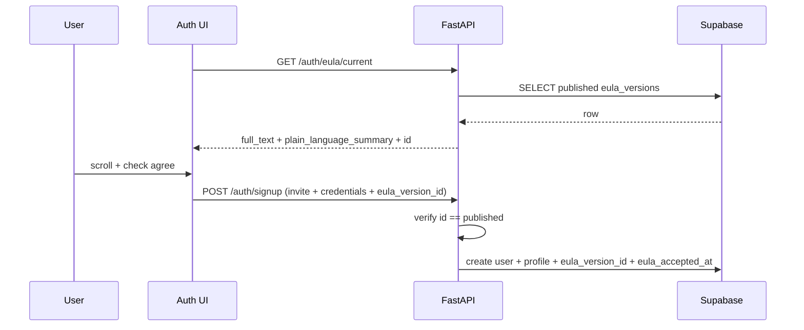

# Architecture push: EULA versioning, acceptance, and admin management

**Audience:** Backend engineers (Supabase migrations, APIs, signup orchestration), frontend engineers (auth + admin UI), and anyone coordinating with counsel on terms content.

**Status:** **Complete on 2026-03-23** — **database-backed EULA versions**, **signup-time acceptance** with **scroll + attest**, **admin CRUD** at **`/admin/eula`**, and **profile linkage** to the accepted version shipped (migration `20260323120000_eula_versions.sql`, `GET /auth/eula/current`, extended `POST /auth/signup`, FastAPI admin routes, signup modal + admin UI). **Out of scope for this document:** final legal text (see marketing handoff), re-acceptance flows for existing users on new versions (deferred), and e-signature integrations.

**Review:** Ready for review (no human sign-off recorded in [`work-log.md`](../../work-log.md)).

**Related:** [`docs/marketing/product-overview-for-legal-counsel.md`](../../../marketing/product-overview-for-legal-counsel.md) (product context for drafting terms), Phase 2 [p2_pr06 — Sign up with invite code](../phase-2-authentication-segmentation/p2_pr06-sign-up-with-invite-code-and-user-type-assignment.md), [`SignupOrchestrationService`](../../../../app/services/signup_orchestration_service.py) / `POST /auth/signup`. **Existing UI:** static legal pages (`/about/termsofuse`, etc. in the frontend) may remain for **public** or **integration-store** copy; **in-app** acceptance should use the **canonical version** from this table so marketing pages and enforced text do not drift without an explicit decision.

---

## Product / architecture brief

We need a **single source of truth** in Postgres for **End User License Agreement** (EULA) **versions**: full legal text, a **content hash** for integrity and debugging, and a **structured plain-language summary** (JSON) for friendly display before users attest.

**Admin:** Operators manage versions on a dedicated **`/admin/eula`** page: list versions, **draft** new versions, **copy** an existing version into a new draft, edit, and **publish** (only one **published** version is active for new signups).

**Signup:** Before account creation completes, the user sees a **modal** that shows the **summary** (and access to **full text** in a scrollable region), must **scroll through** the full EULA (or reach the end — see [UX notes](#signup-modal-ux-notes)), check **“I agree to the terms of this EULA”**, then submit. The backend **creates the user** only after validating acceptance and persists **`eula_version_id`** (and timestamp) on the user’s profile.

---

## Current state (audit — grounded in repo)

- **`user_profiles`** ([`20260313130000_phase2_pr01_auth_schema_user_profile_invite_codes.sql`](../../../../supabase/migrations/20260313130000_phase2_pr01_auth_schema_user_profile_invite_codes.sql)) holds `user_id`, `user_type`, `invitation_code_id`, timestamps — **no EULA columns** today.
- **Signup** is invite-gated via [`SignupOrchestrationService.signup_with_invitation`](../../../../app/services/signup_orchestration_service.py) and `POST /auth/signup` ([`app/routes/signup.py`](../../../../app/routes/signup.py)); provisioning creates the auth user and claims the invite — **no EULA gate** in the API contract yet.
- **Frontend** auth flow lives in `AuthPage` / `api.ts` (`signUpWithInvitation`); **no** EULA modal.
- **Static** Terms of Use pages were added for integration submission (see [`work-log.md`](../../work-log.md) entry *flow-pipeliner-legal-pages*); those are **not** tied to enforced acceptance records.

---

## Target design

### 1. Table: `eula_versions`

| Column | Type | Notes |
|--------|------|--------|
| `id` | `uuid` PK | Default `gen_random_uuid()`. |
| `status` | `enum` or `text` + CHECK | Values: `draft`, `published`, `archived` (or `superseded`). Exactly **one** row with `published` at a time (see [constraints](#constraints)). |
| `version_label` | `text` NOT NULL | Human-readable label (`1.0.0`, `2026-03-22-beta`, etc.); **unique** among non-deleted rows or globally per product policy. |
| `full_text` | `text` NOT NULL | **Complete** EULA body shown in the scrollable area and stored as the legal artifact. |
| `content_sha256` | `text` NOT NULL | Hex-encoded **SHA-256** of `full_text` (UTF-8). Computed in app on write; optional DB-generated check that length = 64. |
| `plain_language_summary` | `jsonb` NOT NULL | See [JSON schema](#plain-language-summary-json-schema). Validated in the API layer (and optionally DB `CHECK` with `jsonb_typeof` + structure). |
| `created_at` | `timestamptz` | Default `now()`. |
| `updated_at` | `timestamptz` | Maintained by trigger or app. |
| `published_at` | `timestamptz` | Set when moving to `published`; null for drafts. |
| `created_by_user_id` | `uuid` nullable | FK to `auth.users(id)` if we want audit (optional v1). |

**Why hash:** Detect accidental edits, support support/debug (“which exact text did we store?”), and future proofs if content is exported elsewhere. It is **not** a substitute for legal review.

**Draft vs published:** Drafts are editable; publishing **archives** the previously published row (status → `archived`) and sets the new row to `published` in one transaction.

### Plain-language summary JSON schema

Stable keys for the UI (names can be adjusted in one migration if counsel prefers different wording):

```json
{
  "dos": [
    "Short bullet: what we will do or allow."
  ],
  "donts": [
    "Short bullet: what we will not do or what you should not expect."
  ],
  "cautions": [
    "Simple-language points about limitations of liability and other caveats (e.g. no liability for lost revenue in beta)."
  ]
}
```

- **`dos` / `donts`:** Arrays of non-empty strings; render as friendly lists in the modal.
- **`cautions`:** Optional section for plain-language **warnings** (including liability limits); can be empty array if folded into `donts` — product choice, but a dedicated list keeps “what to watch for” separate from dos/donts.

**Validation:** Reject saves if arrays contain empty strings, or if unknown top-level keys (strict schema) to avoid drift.

### Constraints

- **At most one published version:** partial unique index, e.g.  
  `CREATE UNIQUE INDEX eula_versions_one_published ON eula_versions ((1)) WHERE status = 'published';`
- **`content_sha256`:** Must match server-side recomputation from `full_text` on insert/update.

### 2. Profile linkage: accepted EULA

Extend **`user_profiles`**:

| Column | Type | Notes |
|--------|------|--------|
| `eula_version_id` | `uuid` FK → `eula_versions(id)` | Version the user attested to at signup (or first login if flow changes). |
| `eula_accepted_at` | `timestamptz` | Server time when acceptance was recorded (same transaction as profile insert). |

**NOT NULL:** For **new** users after this ships, both should be required. Existing rows: backfill strategy — either nullable + “unknown” for legacy, or one-time migration assigning current published version with a flagged `eula_accepted_at` only if business accepts that assumption (document the choice in the migration).

**Optional later:** `user_eula_acceptances` history table `(user_id, eula_version_id, accepted_at, ip, user_agent)` for audit — **deferred** unless compliance requires it for beta.

### 3. APIs

| Endpoint | Purpose |
|----------|---------|
| `GET /auth/eula/current` (or `/public/eula/current`) | Returns **published** version: `id`, `version_label`, `full_text`, `plain_language_summary`, `content_sha256` (optional omit hash for clients), `published_at`. Used by signup modal. **Unauthenticated** or low-friction auth depending on whether signup page needs it before session exists. |
| `POST /auth/signup` (extend body) | Add **`eula_version_id`** (uuid) and **`eula_accepted`** (bool, must be true) OR a single attestation field. Server: reject if `eula_version_id` ≠ current published id, or if published row missing. |
| Admin `GET/POST/PATCH …` | List versions, create draft, update draft, publish, copy — under existing **admin** auth patterns (`/auth/admin/...`), service role or RLS allowing **ADMIN** only. |

**Security:** Never trust client-only checks; **server** validates version id against the single published row at signup time.

### 4. Signup orchestration changes

[`SignupOrchestrationService`](../../../../app/services/signup_orchestration_service.py) (and any path that inserts `user_profiles`) must:

1. Require EULA fields on the signup request.
2. Load published `eula_versions` row; compare `id` to request.
3. Insert `user_profiles` with `eula_version_id` + `eula_accepted_at = now()`.

Order of operations stays compatible with **invite claim** and **compensation delete** on failure; EULA data is part of the successful profile insert.

### 5. Admin UI: `/admin/eula`

- **List:** Table or cards of all versions (label, status, published date, created).
- **View:** Read-only full text + rendered JSON summary + hash (for support).
- **Draft:** Create empty draft or **duplicate** an existing version into a new draft (copy `full_text` + `plain_language_summary`, new `version_label`, status `draft`).
- **Edit:** Markdown or plain textarea for `full_text`; structured editor or JSON editor for summary (validated).
- **Publish:** Confirm dialog; backend transaction archives prior published and publishes selected draft.

Follow existing admin shell routing and styling (`AppShell`, admin pages pattern).

### 6. Signup modal UX notes

- Show **summary** sections prominently; **full text** in a **scrollable** panel with fixed max height.
- **Scroll-to-enable:** Enable the checkbox only after the user has scrolled to the **bottom** of the full-text region (intersection observer / scroll height check), **or** require explicit acknowledgment that they had access to full text — product/legal choice; document whichever ships.
- Checkbox + primary button disabled until conditions met; on success, existing signup API runs with `eula_version_id`.



---

## Row Level Security (RLS)

- **`eula_versions`:** `SELECT` for **published** row allowed to **anon** / `authenticated` for `GET /auth/eula/current` (implementation may use service role from API only — preferred: **no** direct client DB access to drafts).
- **Drafts:** **Admin-only** via backend using service role or privileged JWT claims consistent with other admin routes.

Exact policies should mirror [`auth_admin`](../../../../app/routes/auth_admin.py) / existing admin patterns.

---

## Deferred / follow-ups

- **Re-acceptance:** When a new version is published, **existing** users may need a blocking “accept new terms” flow — not required for initial signup-only scope.
- **Audit trail:** IP / user agent on acceptance — optional table.
- **Localization:** Multiple languages imply either separate rows per locale or nested JSON; out of scope until needed.
- **Public website sync:** If static marketing pages must match DB, add a **publish export** or build step — avoid silent divergence.

---

## Acceptance criteria (architecture)

1. **Schema:** `eula_versions` + `user_profiles.eula_*` columns migrated; constraint guarantees **at most one** published version.
2. **Integrity:** API recomputes SHA-256 and rejects mismatches; JSON summary validates against schema.
3. **Signup:** Cannot complete profile creation without valid published `eula_version_id` and stored acceptance timestamp.
4. **Admin:** CRUD/publish/copy flows exist at `/admin/eula` with **ADMIN**-only access.
5. **Docs:** This document + work-log / index updated when implementation ships.

---

## Suggested implementation phases

1. **Migration** + seed one **published** EULA (content from counsel / existing Terms page).
2. **Public GET** current EULA + **extend** `POST /auth/signup` + orchestration + profile columns.
3. **Frontend** signup modal + scroll/checkbox wiring.
4. **Admin** `/admin/eula` management UI + APIs.

---

## Changelog

| Date | Change |
|------|--------|
| 2026-03-23 | Implementation shipped: signup modal enables the agreement checkbox only after the full-text panel scroll reaches the bottom (IntersectionObserver on sentinel); documented here as the shipped UX. |
| 2026-03-22 | Initial architecture push (draft). |
