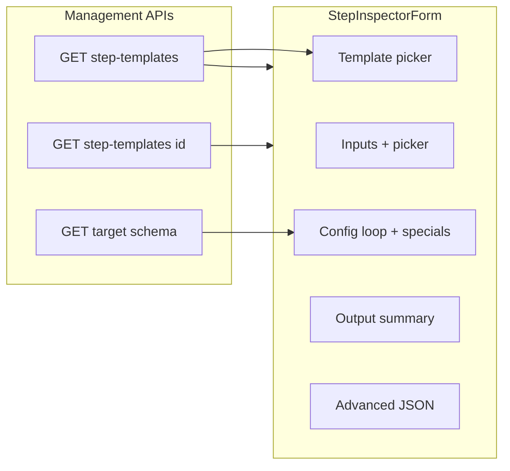

# Architecture push: Pipeline cell / step detail UI polish

**Status:** Open (implementation phased)  
**Audience:** Frontend + platform engineers; product for scope trade-offs  
**Primary code:** `notion_pipeliner_ui` — [`PipelineEditorPlaceholder.tsx`](../../../../../notion_pipeliner_ui/src/routes/PipelineEditorPlaceholder.tsx) (`StepInspectorForm`, graph nodes)

---

## Product / architecture brief

We need to clean up the UI around **graph cells** (step nodes on the canvas) and the **step detail inspector** (right panel): targets, target-backed schema, and surfacing contracts. The goal is **as little raw JSON and ad hoc text editing as possible** while building pipelines—favor schema-driven controls, pickers, and consistent section layout.

This will land in **two stages**:

1. **General case** — For every step template, a **consistent** way to show template identity, inputs (bindings), configuration, and output in the inspector. Information should be scannable, labeled, and aligned with backend contracts.
2. **Template-specific depth** — Where a template needs bespoke UX (complex nested config, domain-specific targets), the UI should still present and edit that configuration **clearly** without falling back to JSON unless truly necessary.

---

## Scope and boundaries

### In scope

- **Inspector (`StepInspectorForm`)** — Section structure, field widgets, binding UX, schema-backed labels, reduction of Advanced JSON reliance.
- **Canvas cell (`StepNode`)** — Title/subtitle/meta clarity so the graph matches mental model (optional polish: richer subtitle from template or connection state).
- **Contracts** — Consumption of `input_contract`, `output_contract`, `config_schema` from step templates (`ManagementStepTemplateItem` / `ManagementStepTemplateDetail` in [`api.ts`](../../../../../notion_pipeliner_ui/src/lib/api.ts)); target schema via `getManagementTargetSchema` where applicable.

### Out of scope (handled elsewhere)

- **Binding picker semantics and validation rules** — See [Input binding & signal picker](../phase-5-visual-editing/p5_input-binding-signal-picker-architecture.md) (modal UX, `signal_ref` vs `cache_key_ref`, pipeline-local rules).
- **Save/persist pipeline graph API** — Covered by management pipeline routes and graph transform tests; this doc only addresses editor presentation.
- **Full graph editor replacement** (e.g. layout engine swap) — Not required for this polish track.

### Dependencies

- Backend exposes step templates with **contracts and schemas** (list and/or detail). Frontend may call `GET /management/step-templates` and `GET /management/step-templates/{id}` when list rows omit full metadata (see existing merge path in `StepInspectorForm`).
- **Target schema** for property-backed steps depends on `data_target_id` / pipeline target resolution.

---

## Current implementation (baseline)

Implementation today lives in **`PipelineEditorPlaceholder.tsx`**, primarily `StepInspectorForm`.

| Area | Behavior |
|------|----------|
| **Template** | [`StepTemplatePicker`](../../../../../notion_pipeliner_ui/src/components/StepTemplatePicker.tsx); draft state supported. |
| **Inputs** | For each `input_contract.fields` entry: [`BindingPathPreview`](../../../../../notion_pipeliner_ui/src/components/BindingPathPreview.tsx) + **Select source** → [`BindingPickerModal`](../../../../../notion_pipeliner_ui/src/components/BindingPickerModal.tsx). |
| **Configuration** | **Generic loop** over `config_schema` keys with `type` → number/boolean/text inputs; **several template-specific branches** (e.g. `step_template_property_set`, `step_template_ai_constrain_values_claude`, templater hides `values` from generic loop and renders **Template values** separately). |
| **Output** | Reads `output_contract.fields`; currently a **comma-separated type summary**, not a rich preview. |
| **Step metadata** | Display name, sequence, failure policy (free text). |
| **Advanced** | Collapsible **raw JSON** for `input_bindings` and `config` with parse errors on blur. |

**Schema source:** If the selected template in `stepTemplates` already includes `input_contract`, `output_contract`, and `config_schema`, the UI synthesizes a detail object in-memory; otherwise it fetches `getManagementStepTemplateDetail`.

**Config schema typing:** [`ConfigSchemaField`](../../../../../notion_pipeliner_ui/src/lib/api.ts) includes optional `label`, `description`, `options`, `min`/`max`; the generic renderer mostly uses **snake_case key → spaced label** and does not yet fully exploit `label`/`description`/`options` for all types.

---

## Gaps driving this push

1. **Raw JSON still central** — Advanced section remains the escape hatch for anything not covered; users can break contracts silently until save/validate.
2. **Inconsistent depth** — Some templates get rich controls (property search combobox, allowable-values preview chips); others fall through to plain text fields.
3. **Output section** — Informative but not **comparable** to inputs (no structured list, no link to downstream binding hints).
4. **Failure policy** — Unconstrained string; should align with allowed enum values if the backend defines them.
5. **Maintainability** — `StepInspectorForm` accumulates `if (currentTemplateId === "...")` branches; without a registry or small sub-components, beta will be hard to extend.

---

## Target design

### Stage 1 — General case (all templates)

**Objective:** One predictable inspector “shape” and maximum use of **schema metadata** before template forks.

1. **Section order and hierarchy** — Align with the agreed model in [Step detail section visual hierarchy](../phase-5-visual-editing/p5_step-detail-section-visual-hierarchy.md): Template → Inputs → Configuration → Output → Step metadata → Advanced. (Current implementation already follows this ordering; keep parity as we add behavior.)
2. **Config field rendering** — Prefer a single **schema-driven renderer** that respects `ConfigSchemaField.label`, `description`, `type`, `default`, `min`/`max`, and **`options`** (select) before falling back to text. Use the same spacing/label patterns as the style guide in `notion_pipeliner_ui/styleguide/` where applicable.
3. **Inputs / outputs** — Keep picker-based binding for inputs; for output contract, render a **structured list** (field name, type, optional one-line description if we add it to contract later) instead of a single concatenated line.
4. **Advanced** — Collapsed by default; **telemetry or copy** (optional) to track how often it is opened during beta to prioritize remaining gaps.
5. **Empty / loading / error** — Explicit states when `templateDetail` is null, schema fetch fails, or `config_schema` is empty (avoid silent empty Configuration).

### Stage 2 — Template-specific inspectors

**Objective:** Best-in-class UX for high-traffic templates without forking the whole form.

Recommended patterns (choose one as the codebase grows):

- **Registry map** — `step_template_id` → lazy component or render props for “extra sections” or overrides (e.g. templater block stays isolated).
- **Backend-driven UI hints** — If we ever add optional `ui_widget` or `x-` extensions to JSON Schema–like config, the generic renderer consumes them; avoid duplicating business rules in the client.

Continue to implement **special** UIs only where the generic schema loop cannot express the domain (e.g. multi-field composite like `allowable_values_source`).

### Canvas cell (lightweight)

- Ensure **display name** and **subtitle** (template slug or short description) help disambiguate steps at a glance.
- Keep node chrome aligned with inspector titles to reduce cognitive mismatch when clicking between graph and panel.

---

## Risks and mitigations

| Risk | Mitigation |
|------|------------|
| **Branch sprawl** in one component | Extract template-specific sections; consider registry; add focused tests per template. |
| **Contract drift** between API and UI | TypeScript types in `api.ts`; optional contract tests or snapshot of sample templates from API. |
| **Users still need JSON** for edge cases | Keep Advanced; consider “Copy from Advanced” / validation messages that point to the broken path. |
| **Performance** — many fetches per step switch | Cache `getManagementStepTemplateDetail` per template id in session; already partially avoided when list items include full contracts. |

---

## Observability (beta)

- **Product:** Optional analytics on Advanced section opens, binding picker opens, template changes (if privacy allows).
- **Engineering:** Console warnings already used in editor for debugging; prefer removing or gating noisy `console.log` in production builds for pipeline editor.

---

## Relationship to Phase 5 docs

| Document | Role |
|----------|------|
| [p5_step-detail-section-visual-hierarchy.md](../phase-5-visual-editing/p5_step-detail-section-visual-hierarchy.md) | **Visual priority** — which sections are primary vs secondary; already largely reflected in CSS classes (`step-detail-section-primary`, etc.). |
| [p5_input-binding-signal-picker-architecture.md](../phase-5-visual-editing/p5_input-binding-signal-picker-architecture.md) | **Binding model** — picker UX and binding types; this beta doc does not redefine signals. |
| [p5_step-template-picker-architecture.md](../phase-5-visual-editing/p5_step-template-picker-architecture.md) | Template selection UX in the inspector. |

---

## Open questions

1. Should **failure_policy** be a **select** fed by an API enum or a static list shared with the worker?
2. Do we add **inline validation** (Zod / JSON Schema) client-side for `input_bindings` / `config` against template contracts to **replace** part of Advanced usage?
3. For **Output**, do we show **example JSON shape** from `output_contract` or stay purely descriptive for beta?

---

## Acceptance criteria (beta-oriented)

- [ ] New user can configure a **representative** pipeline (trigger + multiple step kinds) **without opening Advanced** for routine changes.
- [ ] `ConfigSchemaField` **label** and **description** surface in the generic path where present.
- [ ] Inspector remains usable on **narrow panels** (responsive overflow, no broken comboboxes).
- [ ] No regression to binding picker or save path; existing tests (`graphTransform`, router, API client) stay green.

---

## Phased delivery (suggested)

| Phase | Deliverable |
|-------|-------------|
| **1a** | Harden generic config renderer (labels, selects, descriptions); structured output list. |
| **1b** | Failure policy control + empty/error states for template/schema loads. |
| **2** | Refactor special cases into registry/subcomponents; add any missing template-specific polish from product priority. |

---

## Related links

- Frontend entry: [`PipelineEditorPlaceholder.tsx`](../../../../../notion_pipeliner_ui/src/routes/PipelineEditorPlaceholder.tsx)
- API types: [`api.ts`](../../../../../notion_pipeliner_ui/src/lib/api.ts) — `ManagementStepTemplateItem`, `ManagementStepTemplateDetail`, `ConfigSchemaField`
- Binding utilities: [`bindingUtils.ts`](../../../../../notion_pipeliner_ui/src/lib/bindingUtils.ts), [`BindingPickerModal.tsx`](../../../../../notion_pipeliner_ui/src/components/BindingPickerModal.tsx)
