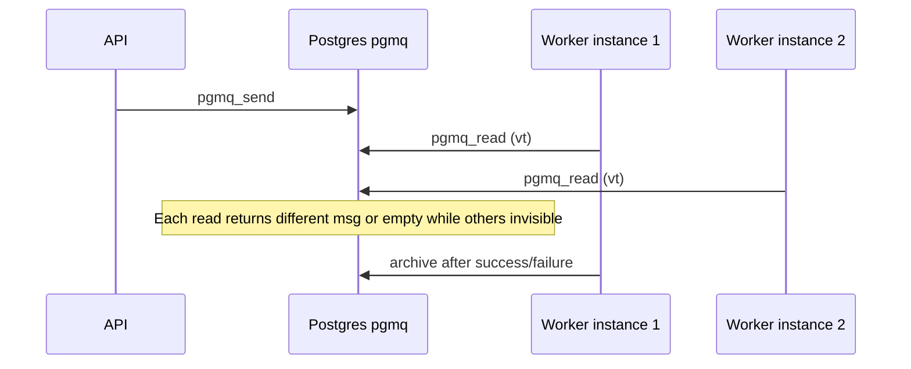

# Architecture push: Worker horizontal scaling and queue coordination

**Launch gate:** This push is scheduled for **Launch stage 2** (expanded beta — scalability), not a blocker for **Launch stage 1** (beta with at most ten users, idea validation). See **Launch stages** in [`work-log.md`](../../work-log.md).

**Audience:** Backend / platform engineers sizing Render workers and Supabase usage.

**Related:** Phase 1 queue foundation ([p1_pr02](../phase-1-platform-migration/p1_pr02-schema-and-queue-foundation.md)), worker consumer ([p1_pr05](../phase-1-platform-migration/p1_pr05-worker-consumer-and-run-lifecycle-persistence.md)), [global and per-user resource limits](./global-and-per-user-resource-limits.md) (enqueue not yet capped), [worker memory / FD investigations](../../incident_investigations/worker_memory_starvation_2026-03-13/findings_and_recommendations.md).

---

## Product / architecture brief

If the worker runs on a single Render instance and **CPU, memory, or database-facing pressure** becomes the bottleneck, we need to know whether **adding more worker instances** is safe: will they **coordinate** by pulling distinct work from the queue, or does the codebase assume a **single active consumer**?

**Short answer:** The worker is designed as a **stateless consumer** of **Supabase Postgres `pgmq`**. There is **no leader election, file lock, or in-process queue** that would block a second instance. Multiple processes can run in parallel; **coordination is delegated to `pgmq.read`** (visibility timeout + archive). Scaling horizontally is **supported in principle**; the practical limits are **Postgres/PostgREST connection and compute budgets**, **per-process concurrency (batch size 1)**, and **at-least-once** semantics with **idempotency only after terminal run state**.

---

## Current state (grounded in code)

### Queue transport: `pgmq` via public RPC wrappers

- Enqueue and dequeue use **`public.pgmq_send`**, **`public.pgmq_read`**, **`public.pgmq_archive`** (wrappers around `pgmq.send` / `pgmq.read` / `pgmq.archive`). See migration `supabase/migrations/20260313120000_public_pgmq_rpc_wrappers.sql`.
- **`pgmq.read(queue_name, vt, qty)`** applies a **visibility timeout (`vt`)**: a message is hidden from other readers for `vt` seconds unless **archived** (ack). That is the coordination primitive for multiple consumers.

### Single queue name per deployment

- `SupabaseConfig.queue_name` comes from **`SUPABASE_QUEUE_NAME`**, default **`locations_jobs`** (`app/integrations/supabase_config.py`).
- **All** async paths that enqueue (e.g. `/locations` async branch, management live-test run) use the **same** `SupabaseQueueRepository` and therefore the **same** queue name. There is no separate “live test queue” in config—live-test payloads are messages on `locations_jobs` (or whatever name is configured).

### Worker process model

- Entrypoint: **`app/worker_main.py`** — one **asyncio** loop running **`run_worker_loop`** until SIGTERM/SIGINT.
- Consumer: **`app/queue/worker.py`** — repeatedly calls **`queue_repo.read(batch_size=1, vt_seconds=vt_seconds)`** (`WORKER_VT_SECONDS`, default **300** in `worker_main`, aligned with `_DEFAULT_VT_SECONDS` in `worker.py`).
- **One in-flight pipeline per worker process** (`batch_size=1`); there is no internal worker-side queue sharding beyond that.

### No multi-instance blockers in application logic

- The worker does **not** assume it is the only process; it does not acquire a global lock before `read`.
- **`SupabaseQueueRepository`** holds **one** schema-scoped client per process (reuse to avoid socket leaks; see work-log entries on FD leak remediation).

### Idempotency and failure handling

- Before work: **`run_repo.get_run_status(run_id)`** — if status is already **`succeeded`** or **`failed`**, the worker **archives the message and skips** (`worker_duplicate_skip`). This covers **duplicate delivery** when the run is already terminal.
- After success or terminal failure: **`queue_repo.archive(message_id)`** removes the message from the active queue.
- **Bounded retries** with **`WORKER_RETRY_DELAYS_SECONDS`**; **`read_count`** ceiling forces terminal path after many visibility cycles (`_READ_COUNT_CEILING`).

---

## Horizontal scaling: what “works out of the box”

| Concern | Behavior |
|--------|----------|
| **Distributing messages** | Multiple worker replicas each call `pgmq_read`; `pgmq` assigns messages with **visibility timeout** so different replicas typically receive **different** messages. |
| **Same Supabase project** | All replicas must use the **same** `SUPABASE_URL`, **`SUPABASE_SECRET_KEY`**, and **`SUPABASE_QUEUE_NAME`** as the API that enqueues. |
| **Render** | Scale the **worker Web Service** to N instances (or run N local processes for testing); no code change required for “another node grabbing tasks.” |

---

## Constraints and risks (why DB/CPU still hurt)

### 1. At-least-once delivery and visibility timeout

- If processing **exceeds `WORKER_VT_SECONDS`**, the message can become visible again while the **first** worker is still executing. A **second** worker may then **also** start work for the same `run_id`.
- **Idempotency** only short-circuits when the run is already **`succeeded`/`failed`**. Two workers could both see **non-terminal** state and both run the pipeline (**duplicate execution**). Risk is reduced when pipelines finish **well under** the VT and VT is tuned conservatively; it is not formally excluded without stronger **lease / row lock** semantics on the run row.
- **Operational mitigation:** Set **`WORKER_VT_SECONDS`** above **p95 pipeline duration** (with headroom); monitor run duration vs VT.

### 2. Database and PostgREST load scale with replicas

- Each worker holds a **Supabase client** (HTTP to PostgREST). Each replica adds **concurrent RPC** (`pgmq_read`, `pgmq_archive`, run table updates) and competes for **Postgres connection pool** limits on the Supabase side.
- Exhaustion of **DB connections**, **CPU on Supabase**, or **API rate limits** can look like “worker can’t keep up” even after scaling Render—**fixing worker count alone may not help** if the database is the cap.

### 3. Throughput per replica

- **`batch_size=1`** and **one pipeline at a time** per process: doubling instances roughly doubles **parallel runs**, not single-run speed.

### 4. No enqueue-side backpressure (today)

- Enqueue paths do not enforce global or per-user caps before `pgmq_send` (see [global-and-per-user-resource limits](./global-and-per-user-resource-limits.md)). Scaling workers **increases consumption rate**; without limits, **queue depth** and **DB load** can still spike.

### 5. External APIs and memory

- Workers call **Notion, Anthropic, Google Places**, etc. More replicas mean **more concurrent calls** to those providers (quotas, rate limits) and **more aggregate memory** on Render. Past investigations: **memory** and **FD** behavior under load ([incident folder](../../incident_investigations/worker_memory_starvation_2026-03-13/)).

---

## Recommended scaling pattern (Render + Supabase)

1. **Keep env aligned:** `SUPABASE_URL`, `SUPABASE_SECRET_KEY`, `SUPABASE_QUEUE_NAME` (and table overrides if any) **identical** on API and every worker instance.
2. **Scale worker instances** when queue latency and **worker CPU** justify it; watch **Supabase** metrics (connections, CPU, slow queries) in parallel.
3. **Tune `WORKER_VT_SECONDS`** to exceed expected **longest** pipeline (including retries and transient DB slowness).
4. **Optionally** tune **`WORKER_POLL_INTERVAL_SECONDS`** (default 1.0) if idle polling noise matters; it does not change correctness.
5. If **DB** is saturated before **worker CPU**, prefer **connection discipline**, **query efficiency**, **Supabase plan limits**, or **enqueue throttling** (future: limits doc) over blindly adding workers.

---

## Observability (existing hooks)

- Startup: **`worker_starting`** logs **`queue_name`**, **`supabase_host`**, poll interval, VT, retry delays (`worker_main.py`).
- Dequeue: **`worker_dequeued`** with `msg_id`, `run_id`, `job_id`.
- Idle: **`worker_queue_poll_idle`** every ~30s when empty (helps catch **wrong queue name / wrong Supabase project**).
- Correlation: enqueue paths log **`pgmq_message_id`** and **`queue_name`** (see `work-log` entries for 2026-03-20).

---

## Open questions / follow-ups

| Topic | Notes |
|-------|--------|
| **Strong single-run execution** | If duplicate execution under VT expiry is unacceptable, add **explicit lease** (e.g. conditional update on `pipeline_runs` / `platform_jobs` with version or `processing_owner`) — not present today. |
| **Multi-queue** | Single queue name; splitting traffic (e.g. interactive vs batch) would be a **product/infrastructure** change. |
| **Connection pooling** | One client per process today; pooling is mostly on **Supabase/Postgres** side—watch connection counts when scaling **N** workers. |

---

## Status

**Architecture push:** Open (operational tuning and optional stronger leases remain). This document captures **current** scaling characteristics and limits as of the codebase review above.
