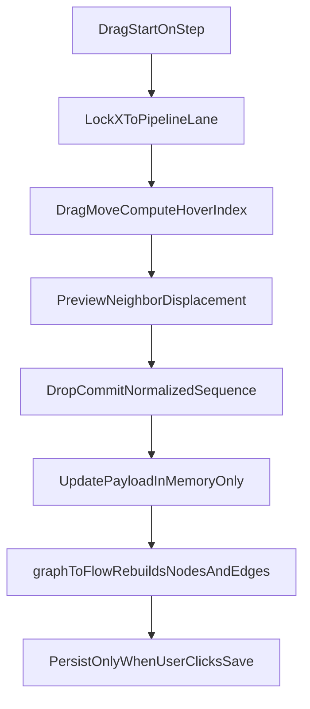

# Architecture: Pipeline step vertical drag reorder (graph editor)

Date: 2026-03-28  
Status: **Ready for review** (spec; implementation TBD)  
Primary surface: `notion_pipeliner_ui` pipeline canvas (React Flow) — `src/routes/PipelineEditorPlaceholder.tsx` (sibling repo; not vendored here)

**Placement:** This file lives under **technical architecture / Phase 5 visual editing** because it ties **canvas interaction** (drag, axis lock, live preview) to the **in-memory job graph model** (`ManagementPipelineGraphPayload`) and existing **save** semantics. It is not a product PRD.

---

## Problem

The pipeline editor already exposes **step order** via numeric `sequence` (e.g. advanced inspector) and structural edits (add/remove). Users expect to **reorder steps by dragging** step nodes on the canvas, **only along the vertical axis** within a pipeline, with **neighboring steps moving aside** during the gesture so the drop target is obvious.

Today, React Flow positions are **layout-derived** from payload order; ad-hoc node moves do not reliably become persisted order unless `sequence` (and the ordered `steps[]` array) is updated.

---

## Goals

1. **Vertical-only drag** — While reordering, the dragged step node may move **only on Y** (relative to its parent pipeline). **No horizontal** movement of the step card within the pipeline lane.
2. **Live reorder preview** — While dragging over other steps, **those steps shift** (jump aside) to show the slot where the dragged step would land if dropped.
3. **In-memory order only** — Reordering updates **`steps[].sequence`** (and/or the **order of `steps[]`**) in **editor state** (`payload`). **No API call** until the user clicks **Save** (same contract as other editor edits).
4. **Consistent with existing transforms** — After a committed reorder, the canvas should **re-layout** from payload via `graphToFlow` so positions and sequential edges stay deterministic.

---

## Non-goals

- Persisting **free-form** x/y positions of nodes (layout remains **sequence-driven**).
- Reordering **pipelines** within a stage or **stages** vertically via drag (could reuse similar patterns later; out of scope here).
- **Cross-pipeline** or **cross-stage** step moves.
- Editing **edges** by dragging connectors (sequential flow remains implied by `sequence`; see [p5_pipeline-step-dependency-visual-indicators.md](./p5_pipeline-step-dependency-visual-indicators.md)).

---

## Current implementation anchors

### Deterministic layout from `sequence`

`notion_pipeliner_ui/src/lib/graphTransform.ts` documents that the backend payload maps to React Flow with **deterministic layout by sequence** — stages top-to-bottom, pipelines horizontal within a stage, **steps vertical within a pipeline** (parent/child nesting, `extent: 'parent'`).

### Editor: payload drives full graph rebuild

On most `payload` changes, a `useLayoutEffect` rebuilds nodes/edges from `graphToFlow(payload, …)`. Config-only updates can use `setPayloadQuiet`, which sets `skipGraphRebuildRef` so the next effect skips one rebuild (avoids expensive layout + selection churn).

```2478:2506:notion_pipeliner_ui/src/routes/PipelineEditorPlaceholder.tsx
  useLayoutEffect(() => {
    if (!payload) return;
    /* Config/binding edits use setPayloadQuiet which sets skipGraphRebuildRef.
     * These edits don't affect node layout (sizes, positions, edges). */
    if (skipGraphRebuildRef.current) {
      skipGraphRebuildRef.current = false;
      return;
    }
    const { nodes: n, edges: e } = graphToFlow(payload, {
      max_steps_per_pipeline: maxStepsPerPipeline,
      trigger_display: graphTriggerDisplay,
      target_display: graphTargetDisplay,
    });
    // ... selection preservation ...
    setEdges(e);
  }, [payload, maxStepsPerPipeline, graphTriggerDisplay, graphTargetDisplay, setNodes, setEdges]);
```

### Editor: `flowToGraph` + payload sync today

`handleNodesChange` applies React Flow changes; **payload is synced from the graph** mainly when nodes are **removed** (via `flowToGraph`). Position-only drags **do not** automatically rewrite `payload` today — reorder-by-drag must **explicitly** update `payload` (or call a dedicated reorder helper), then let `graphToFlow` run.

```2508:2545:notion_pipeliner_ui/src/routes/PipelineEditorPlaceholder.tsx
  const handleNodesChange = useCallback(
    (changes: NodeChange<PipelineEditorNode>[]) => {
      // ... selection + cache-set guard ...
      onNodesChange(changes);

      const removeChanges = changes.filter(/* ... */);
      if (removeChanges.length > 0 && payload) {
        const updatedNodes = applyNodeChanges(changes, nodes) as PipelineEditorNode[];
        const newPayload = flowToGraph(updatedNodes, edges, payload);
        setPayload(newPayload);
      }
    },
    [nodes, edges, payload, onNodesChange, setPayload]
  );
```

### Persistence

Save path remains as in [p5_pr04-visual-pipeline-editor-persistence.md](./p5_pr04-visual-pipeline-editor-persistence.md): **PUT** management pipeline with graph payload built from editor state; reload/refresh from canonical response.

---

## State and contracts

| Concern | Source of truth |
|--------|-----------------|
| **Execution order** within one inner pipeline | `steps[]` order and/or per-step **`sequence`** (sorted when building/saving; see `flowToGraph` / inspector usage). |
| **Transient drag position** | React Flow node `position` during drag (preview only). |
| **Committed order after drop** | Updated **`payload`** — reorder the step objects in `pipeline.steps` and assign **`sequence: 1..n`**. |

**Rule:** Do not rely on saving raw React Flow coordinates; **always** normalize order into `payload` so `graphToFlow` and `flowToGraph` stay aligned with [p5_pipeline-step-dependency-visual-indicators.md](./p5_pipeline-step-dependency-visual-indicators.md) (edges regenerated from structure, not user-drawn).

---

## UX specification

1. **Drag handle / affordance** — Reorder starts from a **step** node inside a **pipeline** (exact handle: header grip vs whole node — implementation choice; whole-node drag is acceptable if it does not conflict with selection/inspector).
2. **Axis lock** — For the dragged node, **fix `position.x`** to the pipeline lane’s expected x (parent-relative). Only **`position.y`** follows the pointer (with optional snapping). If React Flow emits both deltas, clamp in `onNodeDrag` / `onNodeDragStop`.
3. **Insertion index** — Derive a **target index** from the dragged node’s y vs other step nodes in the **same** `pipeline_id` (e.g. compare center-y or pointer y to neighbor midpoints). When the index changes, **move other step nodes** vertically to open a gap (the “jump out of the way” behavior).
4. **Drop** — On drag end, if the index changed:
   - Reorder `payload.stages[*].pipelines[*].steps` for that pipeline.
   - Reassign `sequence: 1..n` for all steps in that pipeline.
   - `setPayload(next)` (normal `setPayload`, **not** `setPayloadQuiet`, so `graphToFlow` runs and snaps layout).
5. **Cancel** — Pointer cancel / ESC (if implemented) restores **previous** order (keep a snapshot from `onNodeDragStart`).
6. **Save** — Unchanged: user must **Save** to persist; closing the tab without saving loses reorder unless autosave is added later.

---

## Recommended implementation shape

Two-phase model:

1. **Preview phase** — During drag: axis-locked movement + optional **live node position updates** for siblings to show the gap (may be done by updating **only** `nodes` state for preview, without committing `payload` every frame — see alternatives below).
2. **Commit phase** — On drop: apply **one** payload mutation, then let existing `graphToFlow` rebuild nodes/edges.



### Implementation options

| Approach | Preview | Commit | Notes |
|----------|---------|--------|------|
| **A — Commit-on-drop only** | During drag, temporarily adjust **sibling** node `y` in React Flow state; dragged node y follows pointer (x locked). | Single `setPayload` reorder on drop. | Fewer payload writes; must avoid fighting `useLayoutEffect` rebuild mid-drag — typically requires a **drag session flag** to skip full `graphToFlow` until drop, or to run a **targeted** node update path. |
| **B — Payload preview** | Each index change calls `setPayload` with reordered steps. | Same as preview (last state wins). | Simpler mental model but may **retrigger full layout** frequently; mitigate with throttling or only updating payload on **index boundary** changes. |

**Recommendation:** Prefer **A** with a **`reorderDragActiveRef`** (or similar): while true, `useLayoutEffect` either skips rebuild or only the dragged pipeline’s step nodes are updated from a small helper mirroring `graphToFlow` vertical spacing — document the chosen approach in implementation PR to avoid selection bugs (see existing `selectedNodeIdRef` / `pendingSelectStepIdRef` patterns).

### React Flow hooks

- Use **`onNodeDrag`**, **`onNodeDragStop`** (and optionally **`onNodeDragStart`**) on the `<ReactFlow>` instance for step nodes, or mark step `Node` props `draggable` with custom handlers.
- Constrain x: set `node.position.x` to the fixed lane value each move.
- Respect **`nodesDraggable={!isSaving}`** and cache-set selection guards where applicable (`shouldBlockLeavingSelectedCacheSetStep` in `notion_pipeliner_ui/src/lib/cacheSetStepValidation.ts`).

### Normalization

After reorder, always **renumber** `sequence` contiguously `1..n` per pipeline to match add-step and inspector behavior and reduce backend ambiguity.

---

## Edge cases

| Case | Behavior |
|------|----------|
| **First / last step** | Index 0 or n−1; preview gap still visible at top/bottom of stack. |
| **Single step** | No-op drag or no reorder feedback. |
| **`max_steps_per_pipeline`** | Reorder does not change count; still enforce cap on **add**. |
| **Inspector / selection** | Keep **same step id** selected across reorder; inspector shows updated **#sequence** badge. |
| **Save in progress** | Drag disabled (`isSaving` already locks canvas). |
| **Keyboard / a11y** | Optional follow-up: move step via keyboard shortcuts (not required for v1 spec). |

---

## Testing notes (for implementation PR)

- Unit-test **pure** helpers: given ordered step ids + drag from index → to index, produce reordered array + `sequence` fields.
- Extend or mirror `notion_pipeliner_ui/src/test/graphTransform.test.ts` if new helpers live next to `graphTransform`.
- Manual: reorder steps, verify **Save** then reload shows new order; verify **Cancel** navigation discard behavior matches other unsaved edits.

---

## Related docs

- [p5_pr04 - Visual Pipeline Editor with Graph Persistence via API](./p5_pr04-visual-pipeline-editor-persistence.md)
- [Pipeline editor: visual indicators for step-to-step flow](./p5_pipeline-step-dependency-visual-indicators.md)
- [Architecture Proposal: Add Step (+) Button Within Pipeline](./p5_pipeline-add-step-button-architecture.md)

---

## Acceptance criteria (spec complete when)

- [ ] This document is linked from the architecture index and describes axis lock, neighbor preview, in-memory payload update, and save-only persistence.
- [ ] Implementation PR references this doc and satisfies **Goals** / **UX specification** above (or explicitly defers with follow-up ticket).
