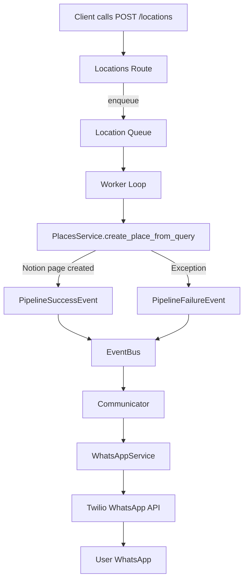

# WhatsApp Run Status Communication Architecture

## Goal

Send run-status updates back to the user over WhatsApp after `POST /locations` is accepted and processed asynchronously.

Design constraints:
- New orchestration service named `Communicator`.
- `Communicator` delegates WhatsApp transport concerns to `WhatsAppService`.
- Success must send a short message with a Notion page link.
- Failure must send error details.
- Environment variables must be explicitly added to both `envs/env.template` and Render service config.

## What we learned from `sputnik_assistant`

Current WhatsApp integration in `sputnik_assistant` is webhook-first:
- Twilio sends inbound webhook requests to `POST /webhook/whatsapp`.
- App responds with TwiML (`<Response><Message>...</Message></Response>`) for immediate replies.
- Environment keys are modeled as:
  - `TWILIO_ACCOUNT_SID`
  - `TWILIO_AUTH_TOKEN`
  - `TWILIO_WHATSAPP_NUMBER`

Implication for this project:
- We still use Twilio credentials and WhatsApp sender number similarly.
- For async job completion messages, we should send outbound messages via Twilio REST API (cannot rely on a synchronous webhook response path because pipeline completion happens later).

## Proposed Architecture



## Service Responsibilities

### `Communicator` (new)

Primary orchestration layer for user-facing notifications:
- Accepts domain events (`PipelineSuccessEvent`, `PipelineFailureEvent`).
- Builds concise user messages from event payloads.
- Handles policy concerns:
  - whether notifications are enabled
  - fallback behavior if recipient is missing
  - truncation/sanitization of error text
- Delegates transport to `WhatsAppService`.

Suggested interface:

```python
class Communicator:
    def notify_pipeline_success(self, event: PipelineSuccessEvent) -> None: ...
    def notify_pipeline_failure(self, event: PipelineFailureEvent) -> None: ...
```

### `WhatsAppService` (new)

Transport adapter for Twilio WhatsApp:
- Owns Twilio client initialization and credential validation.
- Sends outbound WhatsApp text messages.
- Raises structured errors (or returns structured failure result) for logging/retry policy.

Suggested interface:

```python
class WhatsAppService:
    def send_message(self, *, to_number: str, body: str) -> str:  # returns provider message SID
        ...
```

## Integration Points in Current Code

1. App startup wiring (`app/main.py`):
   - Instantiate `WhatsAppService` from env.
   - Instantiate `Communicator` with `WhatsAppService`.
   - Register communicator handlers on the in-memory `EventBus`.

2. Event subscription (`app/queue/events.py`):
   - Keep existing logging subscribers.
   - Add subscribers that delegate to `Communicator` methods:
     - success -> `notify_pipeline_success`
     - failure -> `notify_pipeline_failure`

3. Event payload availability (`app/queue/worker.py`, `app/queue/models.py`):
   - Success event currently includes `result: dict`; this should contain created page metadata from Notion response.
   - Verify page URL extraction path (commonly `result["url"]` from Notion page response).
   - Failure event already includes `error`.

4. Request-side recipient strategy (`app/routes/locations.py`):
   - Add recipient capture to support per-request WhatsApp updates.
   - Preferred: include recipient in request body (for explicit routing), then carry through `LocationJob`.
   - Minimal v1 alternative: single default recipient from env for all notifications.

## Data Contract Changes (Recommended)

Extend queue/job models so notifications can target the correct user:
- `LocationJob.recipient_whatsapp: str | None`
- `PipelineSuccessEvent.recipient_whatsapp: str | None`
- `PipelineFailureEvent.recipient_whatsapp: str | None`

If `recipient_whatsapp` is missing:
- Fallback to `WHATSAPP_STATUS_RECIPIENT_DEFAULT` when configured.
- Otherwise skip send and log `notification_skipped_no_recipient`.

## Message Templates

### Success (concise + link)

Template:
`Done: created your place page for "<keywords>". <notion_url>`

Example:
`Done: created your place page for "stone arch bridge minneapolis". https://www.notion.so/...`

### Failure (include key error details)

Template:
`Could not create a page for "<keywords>". Error: <short_error>.`

Guidelines:
- Keep to one WhatsApp-sized message when possible.
- Truncate very long errors (e.g., 240-400 chars) and append `...`.
- Avoid leaking secrets (sanitize tokens/keys if they appear in exception text).

## Environment Variables to Add

Add to `envs/env.template` and Render environment configuration:

Required for WhatsApp transport:
- `TWILIO_ACCOUNT_SID=`  
- `TWILIO_AUTH_TOKEN=`  
- `TWILIO_WHATSAPP_NUMBER=whatsapp:+14155238886`  (sender number, often sandbox in early testing)

Recommended for status routing/policy:
- `WHATSAPP_STATUS_RECIPIENT_DEFAULT=whatsapp:+1XXXXXXXXXX`  (fallback recipient)
- `WHATSAPP_STATUS_ENABLED=1`  (`1` enables sends, `0` disables without code changes)

Optional operational tuning:
- `WHATSAPP_STATUS_MAX_ERROR_CHARS=300`

Notes:
- Keep values secret in production; do not commit real credentials.
- Render Blueprint currently defines only `secret` in `render.yaml`; add the keys above as Render env vars so startup wiring can read them.

## Render Application Updates

Two safe options:

1. Dashboard-managed env vars (fastest):
   - Add the new Twilio/WhatsApp keys directly in Render Service -> Environment.

2. Blueprint-managed env vars (preferred for reproducibility):
   - Extend `render.yaml` `envVars` with:
     - `TWILIO_ACCOUNT_SID`
     - `TWILIO_AUTH_TOKEN`
     - `TWILIO_WHATSAPP_NUMBER`
     - `WHATSAPP_STATUS_RECIPIENT_DEFAULT` (optional)
     - `WHATSAPP_STATUS_ENABLED` (optional)
     - `WHATSAPP_STATUS_MAX_ERROR_CHARS` (optional)

## Implementation Plan

1. Add new services:
   - `app/services/whatsapp_service.py`
   - `app/services/communicator.py`

2. Wire dependencies in `app/main.py`:
   - Build `WhatsAppService` and `Communicator` from env.
   - Register event subscribers using communicator methods.

3. Extend models and queue flow:
   - Add recipient fields to `LocationJob` and pipeline events.
   - Pass recipient from route -> enqueue -> worker -> event.

4. Update `POST /locations` request model:
   - Add optional `recipient_whatsapp` (or equivalent field name).
   - Validate format starts with `whatsapp:+`.

5. Add tests:
   - Unit tests for `Communicator` message formatting (success/failure/truncation).
   - Unit tests for `WhatsAppService` send behavior (mock Twilio client).
   - Queue/event integration test to verify success/failure triggers notification send.

6. Update docs/config:
   - `envs/env.template` with new vars.
   - README Render env var table with new vars.
   - `render.yaml` env var declarations if using Blueprint-managed config.

## Risks and Mitigations

- Twilio send failures (network/auth/rate limits): log structured failures; do not crash worker.
- Missing recipient: explicit fallback policy + skip with warning.
- Message noise: gate via `WHATSAPP_STATUS_ENABLED` and keep templates concise.
- Sensitive data leak in failure text: sanitize and truncate exceptions before sending.
